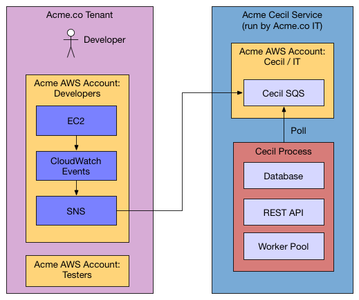

Here is the system overview of what a Cecil deploy looks like:



In this document you will setup the *left hand side* (Acme.co Tenant).  It's assumed that you've already [Installed and configured the Cecil Service](InstallCecilService.md).

## Understanding Cecil Tenants (Accounts), CloudAccounts, and Regions

Here are three example Cecil deployments:


| Deployment | Org Size | Description | Instructions
| --- | --- | --- | --- | 
| **Single Tenant** | Small | If you are just running Cecil in your org (as opposed to running it for multiple sub-orgs), and if you only have a single AWS account you want Cecil to keep under it's watch, then this is all you need | Run **Create Account** once and **Add CloudAccount** once 
| **Single Tenant / Multi AWS** | Medium | If you have multiple AWS accounts in your org, for example if different groups/teams have their own AWS account, you'll want this deployment style  | Run **Create Account** once and **Add CloudAccount** for each AWS account you want to watch 
| **Multi Tenant / AWS** | Large  | If you want a single Cecil deployment to span a large org with different sub-orgs which have different requirements, you'll want to create a Cecil Account for each one of the sub-orgs. | Run **Create Account** for each tenant/sub-org and **Add CloudAccount** for each AWS account owned by that tenant/sub-org


## Create account

In Cecil, tenants are called "Accounts".  Most likely, you will only have a **single Cecil account** for your company.  However, if you are a consulting company and using Cecil to manage the AWS accounts for several customers, you would want to create multiple accounts in Cecil, one for each customer.  (Each of which might be monitoring multiple AWS accounts for that customer)

Create an account via the REST API.

```bash
curl -X POST \
-H "Cache-Control: no-cache" \
-d '{
	"email":"example@example.com",
	"name":"John",
	"surname":"Smith"
}' \
"http://127.0.0.1:8080/accounts"
```

Response:

```json
{
  "email": "example@example.com",
  "account_id": 1,
  "response": "An email has been sent to the specified address with a verification token and instructions.",
  "verified": false
}
```
You will receive an email with a vefication code (aka verification token).


## Verify account and get api token

```bash
curl -X POST \
-H "Cache-Control: no-cache" \
-d '{"verification_token":"0d78a4e0"}' \
"http://0.0.0.0:8080/accounts/1/api_token"
```

Response:

```json
{
  "account_id": 1,
  "api_token": "eyJhbGc",
  "email": "example@example.com",
  "verified": true
}
```

*Note: the api_token will be much longer than this, but has been shortened to make this document more readable*

Use the api token to manage your account.

## Choose an AWS account for Cecil to watch

For the AWS account you wish to monitor/control via Cecil, you will need to have access to an IAM user with an AdministratorAccess policy attached.

For example


| Description | AWS Account ID        | AWS_KEY           | AWS_SECRET_KEY |  Root/IAM | Attached Policies 
| ------------- |:-------------:|:-----:|:-----:|:-----:|:-----:|
| Acme.co Staging AWS account admin user | 788612350743      | AKIAIEXAMPLETXGA5C4ZSQ | ********** | IAM:admin | AdministratorAccess

When you add the CloudAccount to Cecil, you will use these account details and credentials.

## Add CloudAccount

Make the following REST api call:

```bash
curl -X POST \
-H "Authorization: Bearer eyJhbGc" \
-H "Cache-Control: no-cache" \
-d '{
	"aws_id":"788612350743"
}' \
"http://0.0.0.0:8080/accounts/1/cloudaccounts"
```

Response:

```json
{
  "aws_id": "788612350743",
  "cloudaccount_id": 1,
  "initial_setup_cloudformation_url": "/accounts/1/cloudaccounts/1/tenant-aws-initial-setup.template",
  "region_setup_cloudformation_url": "/accounts/1/cloudaccounts/1/tenant-aws-region-setup.template"
}
```

Before this cloudaccount is active, you need to setup the Cecil stacks on your AWS account:

1. The first stack is the **initial stack**. It's a one-time only setup, and will be valid for the whole AWS account.
2.  The second stack is the **region stack**. This stack is to be created on each region you want to monitor with Cecil.

To setup the stacks, download them from the urls provided in this response. And then use AWS cli or AWS web gui to set them up.


## Cloudformation template for initial setup

First download it:

```bash
curl -X GET \
-H "Authorization: Bearer eyJhbGc" \
-H "Cache-Control: no-cache" \
"http://0.0.0.0:8080/accounts/1/cloudaccounts/1/tenant-aws-initial-setup.template" > tenant-aws-initial-setup.template
```

Then `install it:

```bash
$ export AWS_ACCESS_KEY_ID=AKIAIEXAMPLETXGA5C4ZSQ
$ export AWS_SECRET_ACCESS_KEY=*****
$ aws cloudformation create-stack --stack-name "AcmeCecilStack" --template-body "file://tenant-aws-initial-setup.template" --region us-east-1 --capabilities CAPABILITY_IAM CAPABILITY_NAMED_IAM
```

Or alternatively you can upload this in the Cloudformation section of the AWS web UI.

## Cloudformation template for REGION setup

```bash
curl -X GET \
-H "Authorization: Bearer eyJhbGc" \
-H "Cache-Control: no-cache" \
"http://0.0.0.0:8080/accounts/1/cloudaccounts/1/tenant-aws-region-setup.template" > tenant-aws-region-setup.template
```

Then install it:

```bash
$ export AWS_ACCESS_KEY_ID=AKIAIEXAMPLETXGA5C4ZSQ
$ export AWS_SECRET_ACCESS_KEY=*****
$ aws cloudformation create-stack --stack-name "AcmeCecilUSEastStack" --template-body "file://tenant-aws-region-setup.template" --region us-east-1
```

After this has been successfully setup by AWS, you will receive an email from Cecil.

## Add email to owner tag whitelist

```bash
curl -X POST \
-H "Authorization: Bearer eyJhbGc" \
-H "Cache-Control: no-cache" \
-d '{"email":"someone.legit@example.com"}' \
"http://0.0.0.0:8080/accounts/1/cloudaccounts/1/owners"
```

Response:

```json
{
  "message": "owner added successfully to whitelist"
}
```
